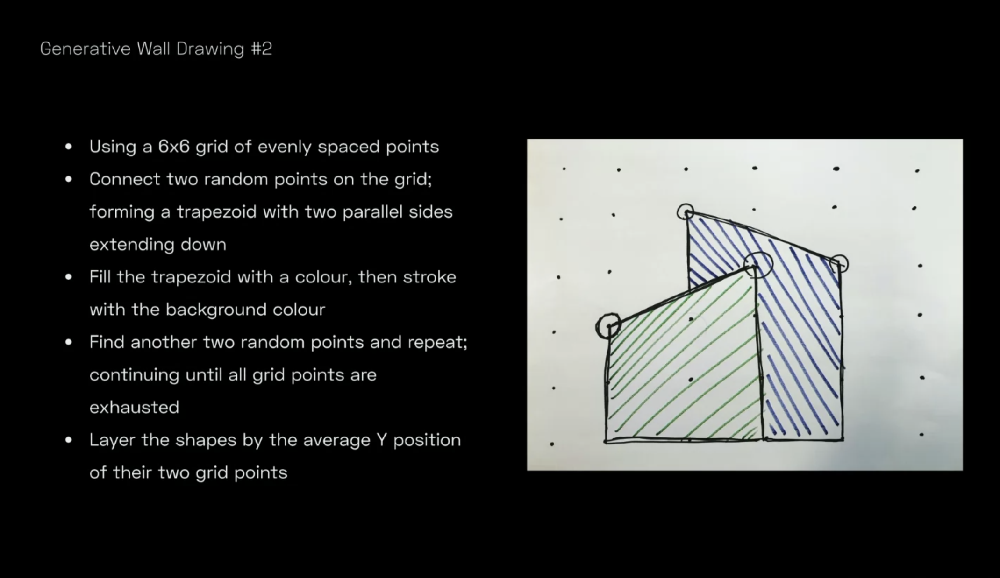

# generative-wall-art
Generative Wall Art in Javascript Canvas

/ This is an exercise /

This is an exercise I have made based on the instructions of [this workshop](https://github.com/mattdesl/workshop-generative-art) from [Matt DesLauriers](https://github.com/mattdesl).

*Here are the instructions*


### Installation and launch

```
npm i
canvas-sketch sketch.js --open
```
